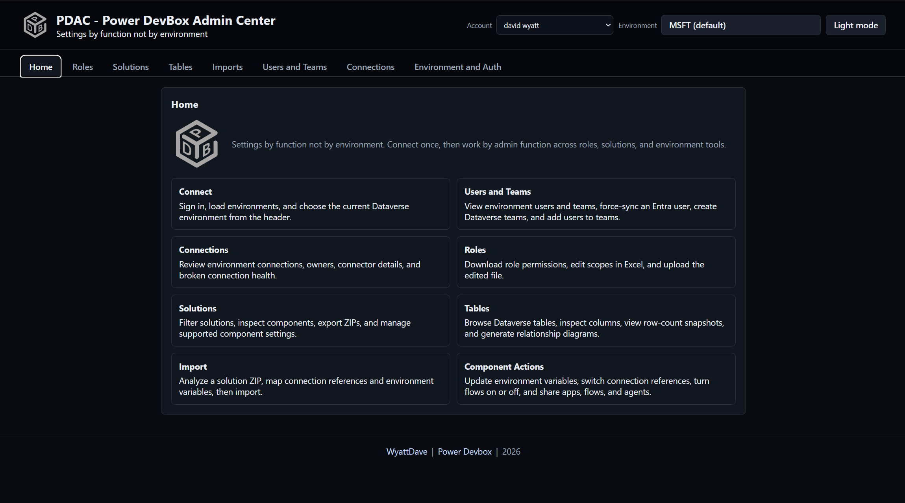
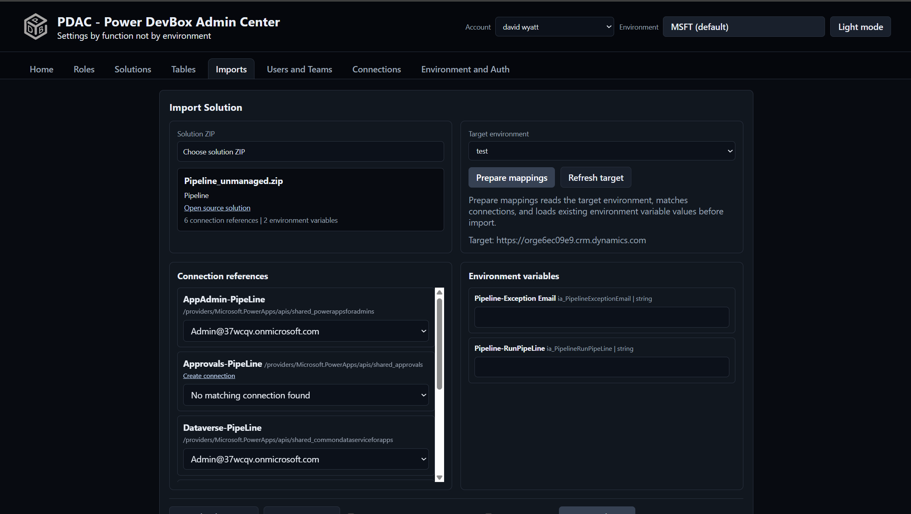

# PDAC - Power DevBox Admin Center

Settings by function not by environment.



PDAC is an administration and reporting app for working across Microsoft Power Platform and Dataverse environments. It provides one function-oriented workspace for authentication, users and teams, connections, security roles, solutions, imports, table metadata, component management, AI usage, flow runs, agent sessions, scheduled cross-environment reports, charts, and historical trends.

PDAC can run as the published Node package or entirely inside its Chrome/Edge extension.

## Browser extension — publishing soon

A packaged browser extension will be published soon. Until then, users can download this repository and load the extension locally as an unpacked extension. The unpacked version contains the complete PDAC UI and API; it does not require Node, localhost, or Windows Task Scheduler.

1. [Download the repository ZIP](https://github.com/wyattdave/pdac/archive/refs/heads/main.zip) and extract it, or clone the repository.
2. Open `chrome://extensions` in Chrome or `edge://extensions` in Edge.
3. Enable **Developer mode**.
4. Select **Load unpacked** and choose the extracted `chrome-ext` folder—not the repository root.
5. Pin PDAC if desired, then select its toolbar icon to open the full-page app.

When a newer version is downloaded, replace the local files and select **Reload** for PDAC on the browser extensions page.

Scheduled reports use a five-minute browser alarm and catch up when the browser starts. The browser may close the extension service worker between checks, but Chrome or Edge must remain running for scheduled work to execute. Reports cannot run while the browser itself is fully closed.

Report files and trend rows are stored in IndexedDB. Schedule, account, and authentication data are stored in extension-local storage. All runtime libraries are included in the extension; it does not load executable code from a CDN.

PDAC stores Microsoft Entra refresh tokens in `chrome.storage.local`. Normal web pages cannot read that storage, but it has the same local-user trust boundary as other credentials in the browser profile: anyone controlling the signed-in OS profile can access or remove the extension's local data.

## Run the Node version

The Node version requires Node.js 22.13 or newer.

Run directly from npm:

```powershell
npx powerdevbox-admin
```

Or install the published npm package globally, then run it from any PowerShell session:

```powershell
npm install --global powerdevbox-admin@latest
powerdevbox-admin
```

PDAC opens at:

```text
http://localhost:4280
```

Update a global installation later with:

```powershell
npm update --global powerdevbox-admin
```

Or install/link it locally and run the `powerdevbox-admin` or `pdac` command:

```powershell
npm link
powerdevbox-admin
```

For development from this checkout:

```powershell
npm start
```

To install PDAC as a per-user background Windows task and start it automatically at sign-in:

```powershell
npm run install-startup
```

This is optional. The task runs with the signed-in user's Windows credentials. Without it, `npx powerdevbox-admin` or `npm start` runs only for the lifetime of that terminal session. To stop and remove the background task:

```powershell
npm run remove-startup
```

The task runs `server.mjs` directly without a recurring `npx` command. Its launcher, configuration, and logs are stored below `%LOCALAPPDATA%\PowerDevBoxAdmin`; report cache, schedule, and SQLite trend data are stored in its `data` directory. Application data is kept outside the installed npm package so an update does not replace it. The previous schedule JSON is retained as a `.backup` when schedule state is written.

Optional startup values:

```powershell
$env:SECURITY_ROLES_PORT = "4280"
$env:PP_REGION = "prod"
$env:PP_ENVIRONMENT_ID = "Default-00000000-0000-0000-0000-000000000000"
$env:PP_ORG_URL = "https://org.crm.dynamics.com"
$env:POWERAPPS_CLI_ENABLE_BROWSER_CONNECTION = "true"
powerdevbox-admin
```

`POWERAPPS_CLI_ENABLE_BROWSER_CONNECTION=true` enables the interactive local browser callback flow for connectors that cannot be created silently.

## Scheduled reports and trend data

The Reports tab provides two independent controls:

- **Run daily reports in the background** generates each selected Excel report once per day and restores the completed files as download links.
- **Enable trend data to be saved** writes report totals to local trend storage: IndexedDB in the Chrome extension and SQLite in the Node server.

Monthly event and session reports use their timestamped rows to reconstruct any missing month-to-date snapshots without replacing snapshots already stored. Trend charts default to the current calendar month, and usage forecasts apply the observed pattern for each day of the week through month end. For a report with **Auto download when ready** enabled, the browser downloads that day's cached files once, on the first UI load for that account and report.

In the Reports tab, enable **Run daily reports in the background**, select environments, and optionally enable **Enable trend data to be saved**. The app checks immediately at startup and after a settings change, then every five minutes. Each due report is tracked independently, so successful reports are not repeated while a failed report is retried. A report is marked complete only after its Excel files are generated and, when enabled, its trend snapshot is committed. The Node web page does not need to be open while its server is running; the extension uses its background service worker.

The Settings tab can export, clear, and import local trend data. Use **Download import template**, keep its worksheet names and headers unchanged, enter rows, then choose **Import Excel**. Imported rows replace matching report/account/date/environment snapshots and retain the same two-year history policy as generated trend data.

## Features

- **Home**: a quick guide to the available administration and reporting functions.
- **Settings, accounts, and environments**: sign in with Microsoft Entra ID, use multiple accounts, choose the active Dataverse environment, control which environments appear in the header picker, copy environment details, and manage local trend data.
- **Users and Teams**: page through environment users and teams, force-sync an existing Entra user into Dataverse, create owner/access/security-group/Office-group teams, add users to teams, and assign the correct business-unit copy of a security role.
- **Connections**: list environment connections with connector, owner, and health details; search and filter by owner or broken state; open an owned broken connection for repair; and delete connections after confirmation.
- **Roles**: list editable root roles, create or rename roles, choose CSV or XLSX, export table and miscellaneous privileges, edit scope values, and upload the files to apply permissions.
- **Solutions**: filter by name, publisher, managed state, Active Solution, or Default Solution; download a solution inventory report; open a solution in Power Apps, Power Automate, or Copilot Studio; inspect components; export managed or unmanaged ZIPs; and send an export directly to the Imports workflow.
- **Tables**: browse custom or all Dataverse tables and columns, view metadata and row-count snapshots, open tables in Power Apps, generate Mermaid relationship diagrams, download diagrams as SVG or PNG, copy Mermaid source, and export table-design workbooks.
- **AI Flow**: query configurable date ranges, filter AI events by credit type, creator, tool, model, or source, group totals by flow or model, inspect AI Builder and Copilot Studio consumption, and export the results to Excel.
- **Flow Runs**: query configurable date ranges, filter by status, trigger, search text, errors, or minimum duration, open individual Power Automate runs, review per-flow success/failure/duration totals, and export to Excel.
- **Agent Sessions**: page through Copilot/Dataverse conversation sessions, filter by date and agent, view per-agent totals, export totals to Excel, and fetch a redacted transcript only when a session is opened.
- **Reports**: run AI Flow, Agent Sessions, Solutions, and Flow Runs reports across selected environments; generate totals and raw workbooks; queue manual runs; schedule daily runs; auto-download completed files; and restore cached download links.
- **Charts**: view the latest cross-environment usage, run-health, session, and solution-inventory snapshot produced by reports.
- **Trends**: retain up to two years of report totals, choose preset or custom date ranges, compare historical values, and use month-end forecasts where available.
- **Trend data management**: inspect local trend tables, export one table or all tables to Excel, clear stored records, download the supported import template, and import validated XLSX data into IndexedDB or SQLite.
- **Solution component actions**: update environment-variable values, switch or create compatible connection-reference connections, turn flows on or off, inspect read-only run-only/manual-trigger settings, and share supported flows, canvas/code apps, and Copilot Studio agents with users or teams.
- **Imports**: analyze a solution ZIP, choose a target environment, map connection references, override environment-variable values, export or import deployment-settings JSON, and import the solution with overwrite/publish options.

## Users and Teams

1. Sign in and select an environment.
2. Open **Users and Teams**.
3. Click **Load users and teams**.
4. Use **Add user** with the user's Microsoft Entra object ID to request Dataverse user sync.
5. Use **Create team** to create an owner, access, security group, or Office group team.
6. Select a team, then add loaded enabled users as members.
7. Select **Assign role** from a loaded user or team row, then search for and choose the security role in the popup.

Adding a user uses the supported Power Platform admin force-sync pattern. The user must already exist in Microsoft Entra ID and must meet the environment requirements such as license, sign-in status, and environment security group membership.

Role assignment uses the Dataverse user-role and team-role associations. When you choose a root role, PDAC assigns the matching inherited role copy for the selected user's or team's business unit.

## Connections

1. Sign in and select an environment.
2. Open **Connections**.
3. Click **Load connections**.
4. Use the search box to filter by connection name, connector, owner, ID, or status.
5. Use **My connections only** or **Broken only** to narrow the list.
6. For a broken connection owned by the selected account, use **Broken - Click to Fix** to open the connection in Power Apps and re-authenticate it.
7. Use **Delete** to remove a connection after confirming. Apps and flows using that connection may stop working.

## Roles


1. Sign in and select an environment.
2. Open **Roles** and click **Load roles**.
3. Select or create a role.
4. Download the table permissions file or misc privileges file.
5. Edit the permission columns in Excel.
6. Upload the edited file to apply the changes.

Valid scope values:

- `none`
- `user`
- `business`
- `parent`
- `org`
- `recordfilter`

Rows with `none` are not assigned to the role. Rows with any other scope are sent to Dataverse using `ReplacePrivilegesRole`.

## Solutions

1. Open **Solutions**.
2. Click **Load solutions**.
3. Filter by name, unmanaged only, or publisher.
4. Select a solution.
5. Click **List components** to inspect solution components.
6. Click **Export solution** to download a ZIP, or **Deploy** to stage the ZIP for the Import tab.

The export action calls the Dataverse `ExportSolution` unbound action.

## Tables


1. Open **Tables**.
2. Choose **Custom** or **All**, then click **Load tables**.
3. Select a table to load columns.
4. Choose **Custom columns** or **All columns**.
5. Click **Create diagram** to open a full-screen Mermaid ER diagram for the selected table and directly related tables through lookup relationships.
6. Use the diagram toolbar to zoom, download SVG or PNG, copy Mermaid, or close the popup.
7. Click **Create table** to open a table-design document, then export it to Excel.

Diagrams and table-design documents show custom columns plus the primary name/name column, `createdby`, and `createdon`. The `createdby` relationship to `systemuser` or `team` is intentionally not drawn.

From the **Solutions** tab, load components for a solution. If the solution contains table components, PDAC shows **Create diagram** and **Create table** actions for the solution. The solution diagram includes all solution tables plus directly related lookup-table dependencies outside the solution, with external dependencies highlighted. The solution table document adds the table display name as the first column.

## Component Actions

Supported actions from the solution component list:

- **Environment variable**: read the related environment variable value, update it, and create the value row if only a default exists.
- **Connection reference**: switch to an existing matching connection or create a connection using the same Microsoft Power Apps action package used by the Power Apps CLI.
- **Flow**: turn on or off by updating the Dataverse `workflows` row with the paired `statecode` and `statuscode`.
- **Flow sharing**: share the workflow row as user or co-owner through Dataverse record sharing.
- **Canvas app sharing**: share as user or co-owner.
- **Code app sharing**: share as user or co-owner.
- **Agent/bot sharing**: share bot records with users or teams as user, co-owner, or analytics viewer. Analytics viewer grants Dataverse read access to the bot row; Copilot Studio analytics may still need product permissions outside record sharing.

Flow run-only users and manual-trigger connection mode are not updated by PDAC because those settings are exposed through the Power Automate Management connector rather than the supported Dataverse workflow row API.

Connection creation is silent for SSO-only connectors where Microsoft supports it. Other connectors need the browser connection flow, so start PDAC with:

```powershell
$env:POWERAPPS_CLI_ENABLE_BROWSER_CONNECTION = "true"
npm start
```

## Import



1. Upload a solution ZIP or use **Deploy** from the Solutions tab.
2. Select a target environment.
3. Click **Prepare mappings**.
4. Map connection references to target connections.
5. Review and edit target environment variable values.
6. Import the solution.

Settings files use this shape:

```json
{
  "EnvironmentVariables": [
    {
      "SchemaName": "cr123_MyVariable",
      "Value": "Prod value"
    }
  ],
  "ConnectionReferences": [
    {
      "LogicalName": "cr123_sharedcommondataserviceforapps_abc12",
      "ConnectionId": "00000000000000000000000000000000",
      "ConnectorId": "/providers/Microsoft.PowerApps/apis/shared_commondataserviceforapps"
    }
  ]
}
```
